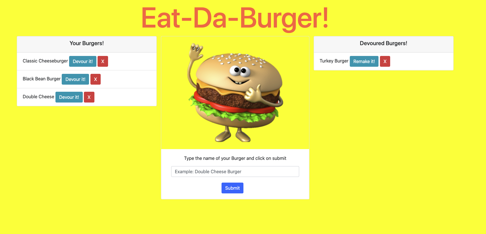

# Good README Generator

## Description
It is a burger logger application that follow the MVC design pattern. It uses Node and MySQL to query and route data and Handlebars to generate the HTML.

## Table of contents
* [Description](#Description)
* [Installation](#Installation)
* [Usage](#Usage)
* [License](#License)
* [Contributing](#Contributing)
* [Screenshot](#Screenshot)
* [Questions](#Questions)
## Installation
No need to install anything.
## Usage
Click on the deployed link, enter a burger name in the input field, click on submit. It will generate the input burger's name with a 'Devoure it! and 'close' buttons. Click on the button to devoured your burger or 'close' to delete it. The burger can be remade after being devoured by clicking on 'Remake it!' button.
## Licence
This app is under the MIT License.
## Contributing
I would be happy if anyone decide to improve it. All comments and suggestions are welcomed.
## Screenshot
[Click here to see the demo Video](https://www.youtube.com/watch?v=HVfvx0v68ck)

## Questions
Contact me: kevkouadio@gmail.com

My Github: http://github.com/kevkouadio